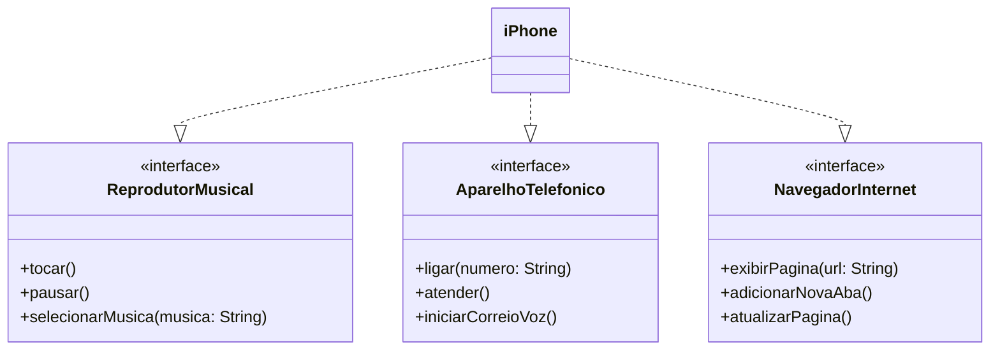

# DIO - Trilha Java Básico

## Modelando o iPhone com UML: Funções de Músicas, Chamadas e Internet

### Objetivo 1

Modelar as funcionalidades:
1. **Reprodutor Musical**
   - Métodos: `tocar()`, `pausar()`, `selecionarMusica(String musica)`
2. **Aparelho Telefônico**
   - Métodos: `ligar(String numero)`, `atender()`, `iniciarCorreioVoz()`
3. **Navegador na Internet**
   - Métodos: `exibirPagina(String url)`, `adicionarNovaAba()`, `atualizarPagina()`

### Resultado

### Objetivo 2

Implementar as classes e interfaces correspondentes em Java.

### Resultado

Vá para o código da implementação das classes em java clicando aqui -> [Classe iPhone](https://github.com/Guxlhrm/trilha-java-basico/blob/main/desafios/poo/iphone_java/Main/src/iPhone.java) e [Classe Main](https://github.com/Guxlhrm/trilha-java-basico/blob/main/desafios/poo/iphone_java/Main/src/Main.java)
